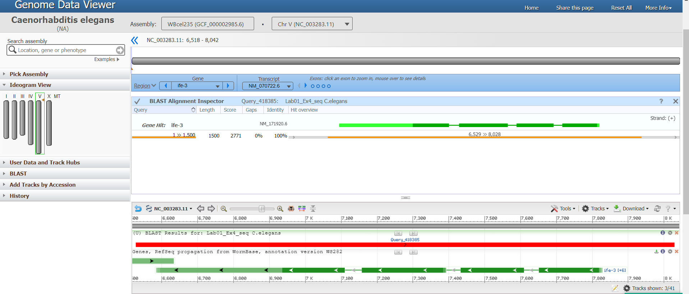

```{r setup, include=FALSE}
knitr::opts_chunk$set(echo = TRUE)
```

# Question 1: Hardy- Weinberg equiibrium 

*We consider a gene locus with two possible alleles (say A and a) and a diploid population with N individuals. Hence, there are 2N alleles in the population. Let p be the proportion of As in the allele population and q the population of as (of course p + q = 1). A population is said to be in Hardy-Weinberg equilibrium if the proportion of AA homozygotes is $p^2$, aa homozygotes is $q^2$ and the proportion of heterozygotes (Aa) is 2pq.*  

## Question 1.1
*Show that with random mating (i.e. both alleles of the offspring are just randomly, with proportions p and q, drawn from the parental allele population) Hardy-Weinberg equilibrium is attained in the first generation. What is the proportion of A and a alleles in the offspring population? Hence, with random mating, can a population in Hardy-Weinberg equilibrium ever deviate from it?*  


## Solution: 

Let P represents the proportion then it is given that: 

$$P(A) = p...eq(1)$$

$$P(a) = q...eq(2)$$ 
The population is said to be in Hardy-Weinberg equilibrium if:  

$$P(AA) = p^2...eq(3)$$

$$P(aa) = q^2...eq(4)$$

and  $$P(Aa) = 2pq...eq(5)$$

Now, the allele proportions at each generation are obtained by pooling together the alleles from each genotype of the same generation according to the expected contributions. Therefore, we can write the equation for P(A) as: 


$$P(A) = P(AA) + P(Aa)...eq(6)$$
and similarly for P(a) we can write it as:

$$P(a) = P(aa) + P(Aa)...eq(7)$$

Further, eq(1), eq(2), eq(3) and eq(4) and utilizing random mating, we can list out proportionas as:

$$P(AA)=P(A)*P(A) =p*p=p^2...eq(8)$$ 

$$P(aa)=P(a)*P(a) =q*q=q^2...eq(9)$$ 

$$P(Aa)=P(A)*P(a) =p*q=pq...eq(10)$$ 
also,
$$P(aA)=P(a)*P(A) =q*p=pq$$ 

adding equations 8,9 and 10, and putting values from equations 3 and 4, we get:

$$P(AA)+P(aa) +2P(Aa)$$
which equates to, 
$$ p^2+q^2+2pq= (p+q)^2=1 $$

as $p+q=1$. 

and proportion of heterozygotes using equation 10 is:
$$P(A,a) + P(a,A) = 2pq$$

Since it fulfills all conditions of Hardy-Weinberg equilibrium, We can therefore say that with random mating,Hardy-Weinberg equilibrium is attained in the first generation and the population does not deviate from it.


ref : https://en.wikipedia.org/wiki/Hardy%E2%80%93Weinberg_principle

## Question 1.2  
*We look at the MN blood group has two possible co-dominating (both contribute to heterozygotes) alleles $L^M$ (denoted M) and $L^N$ (denoted N). In a population of 1000 Americans of Caucasian descent the following genotype counts were observed, 357 individuals were MM, 485 were MN and 158 were NN. Use a chi-square goodness of fit test to test if the population is in Hardy-Weinberg equilibrium.*  

## Solution :

```{r pressure, echo=TRUE}
#Given that 
n<-1000   # population 
mm<-357   # number of mm
mn<-485   # number of mn
nn<-158   # number of nn
P_mm<-mm/n  #proportion of mm in population
P_mn<-mn/n  #proportion of mm in population
P_nn<-nn/n  #proportion of mm in population

#Now calculting p, q, p2 and q2 (i.e all parameters) for Hardy-Weinberg equilibrium

#proportion of N and M in the alleles are represented by p and q respectively :
# one way to calculate
p<-P_mm+(0.5*P_mn)
q<-P_nn+(0.5*P_mn)

#another way to calculate p and q
#total no of alleles is 2n 
total<-2*n
p<-(mm*2+mn)/total
q<-(nn*2+mn)/total

#cross check 
p+q  # p+q =1

#Now, calculating p_square, q_square and two_pq

p_square<-p^2
q_square<-q^2
two_pq<-2*p*q


#chi-square goodness of fit test (one method)

chi_test = chisq.test(c(P_mm, P_mn, P_nn), p=c(p_square, two_pq, q_square))
print(chi_test)


```

The chi-square goodness of fit test was performed and the obtained p-value is 1. This signifies that we can not reject the hypothesis that the population is in a Hardy-Weinberg equilibrium state.

ref : 
1. https://en.wikipedia.org/wiki/Hardy%E2%80%93Weinberg_principle  
2. https://www.biologysimulations.com/post/how-to-use-chi-squared-to-test-for-hardy-weinberg-equilibrium#:~:text=Chi%2Dsquared%20is%20a%20statistical,selection%2C%20and%20large%20population%20size.

# Question 2  
## 2.1  
*Name the protein products of the CDS.*  
The name of the protein products is RecQ type DNA helicase.  
## 2.2  
*Write the first four amino acids.*  
The first four amino acids is MVVA  
M - Methionine  
V - Valine  
A - Alanine  
## 2.3  
*Save (and submit) the nucleotide sequence of the coding strand that corresponds to these amino acids as a FASTA format file.. Use backtranseq (https://www.ebi.ac.uk/Tools/st/emboss_backtranseq/, note species used) to obtain the sequence from the protein sequence.*  

The reverse sequence for the nucleotide sequence:  

```{r,echo=FALSE}
sequ <- read.delim("out.txt")
print(sequ)
```
  
## 2.4  
*Compare your obtained coding strand sequence with the nucleotide sequence provided (when following the CDS link). Are they the same or do they differ? Try reversing and taking the complement (e.g. http://arep.med.harvard.edu/labgc/adnan/projects/Utilities/revcomp. html or http://www.bioinformatics.nl/cgi-bin/emboss/revseq or write your own code) of the your coding strand DNA. Explain what happened and why. Save (and submit) the nucleotide sequence of the template strand that corresponds to these amino acids as a FASTA format file.*  

```{r,echo=FALSE}
sequ <- read.delim("outseq.txt")
print(sequ)
```
  
In reverse compliment, The last base pair will be converted to first base pair and the direction will change from 5' to 3' to 3' to 5'. The above sequence is just a reverse compliment sequence.  

## 2.5  
*Using the sequence shown in the record, give the nucleotide number range that corresponds to these amino acids (protein sequence). Find and report the stop codon in the nucleotide sequence. On which chromosome does the genomic sequence lie?*  
The nucleotide number range that corresponds to these amino acids using the sequence in record is MVVA and the number range is 5651 to 5662 however, its the first 12 (1 to 12) that would correcponds to MVVA in case we have selected "Show reverese compliment" on GenBank.  

# Question 3  
## 3.1  
*Read up on C. elegans and in a few sentences describe it and why it is such an important organism for the scientific community.*  
C. elegans (Caenorhabditis elegans) is unsegmented, vermiform pseudocoelomate which lacks respiratory or circulatory system. The first research on it started in 1963 in australia. It is the only species which has connectome diagram. It does not require a sexual partner to reproduce. It is first multi cellular organism to have whole genome sequenced.  

## 3.2  
*Use the nucleotide BLAST tool to construct a schematic diagram that shows the arrangement of introns and exons in the genomic sequence. In the BLAST tool, https://blast.ncbi.nlm.nih.gov/Blast.cgi?PAGE_TYPE=BlastSearch, choose database RefSeq Genome Database and remember that the species source of the genomic sequence is Caenorhabditis elegans. Use the 4 Genome Data Viewer button. Alternatively you may use https://wormbase.org/tools/blast_blat.*  



## 3.3  
*Note the numbering of the sequences in the alignment (i.e. pairing of query and database sequences). Does the database genomic sequence progress in the same direction as the query sequence? What would happen if you reverse complement your query sequence (e.g. http: //arep.med.harvard.edu/labgc/adnan/projects/Utilities/revcomp.html or http://www. bioinformatics.nl/cgi-bin/emboss/revseq or write your own code) and do the search with such a reverse complemented sequence?*  

The database genomic sequence is shown below:  
```{r,echo=FALSE}
sequ <- read.delim("out1.txt")
print(sequ)
```

The reverse complemented sequence of the query sequence is:  
```{r,echo=FALSE}
sequ <- read.delim("outseq1.txt")
print(sequ)
```
  
The database genomic sequence moves in the same direction. The direction is from 1 to 60, 61 to 120, etc and 6529 to 6588, 6589 to 6648.  

## 3.4  
*On what chromosome and what position is the query sequence found?*  

The position in the query sequence is 6529 to 8028.  

## 3.5  
*Extract the DNA code of each exon and using transeq (https://www.ebi.ac.uk/Tools/st/emboss_transeq/) find the protein code of the gene. You can also use blastx (https://blast.ncbi.nlm.nih.gov/Blast.cgi?PROGRAM=blastx&PAGE_TYPE=BlastSearch&LINK_LOC=blasthome or https://wormbase.org/tools/blast_blat) to obtain protein sequences. How do they compare to your translation?*  
Tbhe protein code of the gene using blastx is:  

```{r,echo=FALSE}
sequ <- read.delim("out2.txt")
print(sequ)
```
  
DNA code of each exon using transeq:  
```{r,echo=FALSE}
sequ <- read.delim("outseq2.txt")
print(sequ)
```
  

## 3.6  
*Hovering over an exon you should see links to View GeneID and View WormBase. These point to pages with more information on the gene. Follow them and write a few sentences about the gene.*  
The gene symbol is ife-3. The gene belongs to eukaryotic translation initiation factor 4E family (eIF-4E) with eukaryotic cellular mRNA. In humans it is encoded as EIF4E3 gene.The exon count is 4. 

# Reference  
1. https://en.wikipedia.org/wiki/Hardy%E2%80%93Weinberg_principle  
2. https://www.sciencedirect.com/topics/neuroscience/hardy-weinberg-principle
3. https://biology.andover.edu/Joomla/index.php/andover-biology-department-textbooks/biol-58x-sequence-advanced-biology-textbook/evolution/436-the-hardy-weinberg-equilibrium  
4. https://iupac.qmul.ac.uk/AminoAcid/A2021.html
5. https://en.wikipedia.org/wiki/Caenorhabditis_elegans
6. https://en.wikipedia.org/wiki/EIF4E3
  
# Appendix
```{r ref.label=knitr::all_labels(), echo = T, eval = F}
```

  


